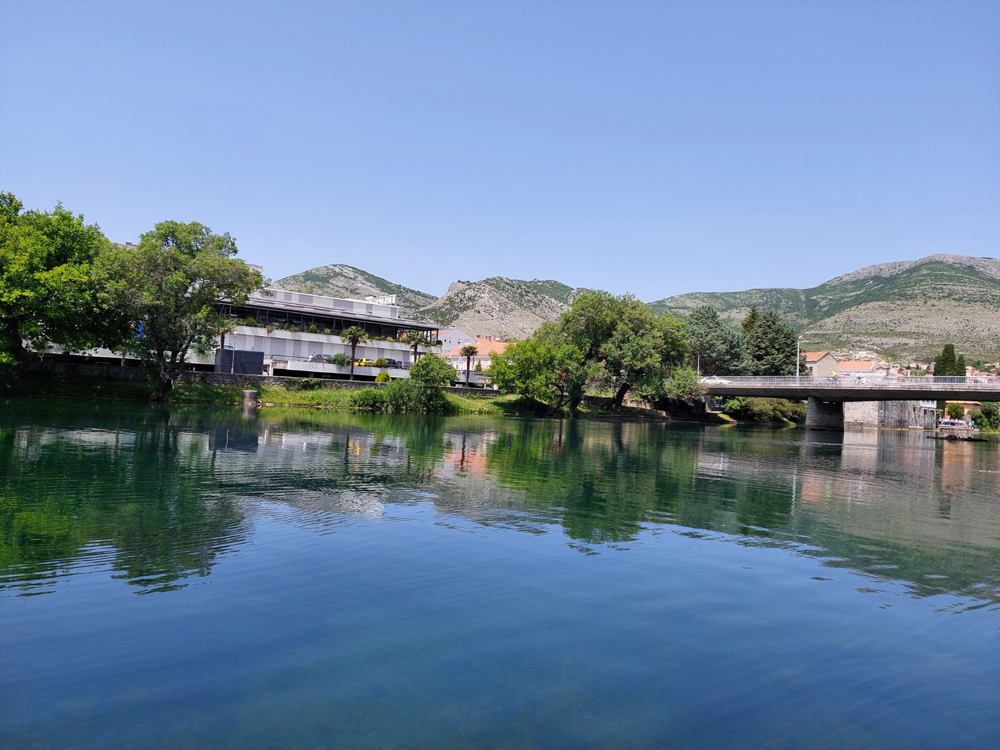

# Trebišnjica Riverside Apartment

A responsive landing page for a luxury apartment located on the banks of the Trebišnjica river in Trebinje, Bosnia and Herzegovina.

🔗 **Live Demo:** [avule.github.io/trebisnjica-riverside-apartment](https://avule.github.io/trebisnjica-riverside-apartment)

---



---

## Features

- **Responsive design** — mobile-first approach, tested on all screen sizes
- **Smooth scroll navigation** — navbar with scroll effect and mobile hamburger menu
- **Interactive gallery** — category tabs with lightbox for full-screen image viewing
- **Contact form** — integrated with Formspree for real email delivery
- **Booking.com integration** — direct link to the property listing
- **Scroll reveal animations** — elements animate on scroll using Intersection Observer API
- **Open Graph tags** — rich link previews on WhatsApp, Viber, Facebook
- **Custom favicon** — SVG favicon matching the brand colors

---

## Built With

- **HTML5** — semantic markup
- **CSS3** — Flexbox, Grid, custom properties, media queries
- **JavaScript** — vanilla JS, no frameworks or libraries
- **Formspree** — contact form email service
- **Google Maps Embed** — location map
- **Lucide Icons** — SVG icon set
- **Google Fonts** — Playfair Display & Inter

---

## What I Learned

- Mobile-first CSS architecture with a design token system (CSS custom properties)
- Complex CSS Grid layouts for responsive gallery
- Intersection Observer API for scroll-based animations
- Building a lightbox from scratch without external libraries
- Git version control workflow
- Deploying a static site with GitHub Pages
- Integrating third-party services (Formspree, Google Maps, Booking.com)

---

## Project Structure

```
trebisnjica-apartment/
├── index.html
├── css/
│   └── style.css
├── js/
│   └── script.js
├── images/
│   └── (21 property photos)
└── favicon.svg
```

---

## Getting Started

Clone the repository and open `index.html` in your browser:

```bash
git clone https://github.com/avule/trebisnjica-riverside-apartment.git
cd trebisnjica-riverside-apartment
open index.html
```

---

*Built as a portfolio project to practice HTML5, CSS3, and vanilla JavaScript.*
